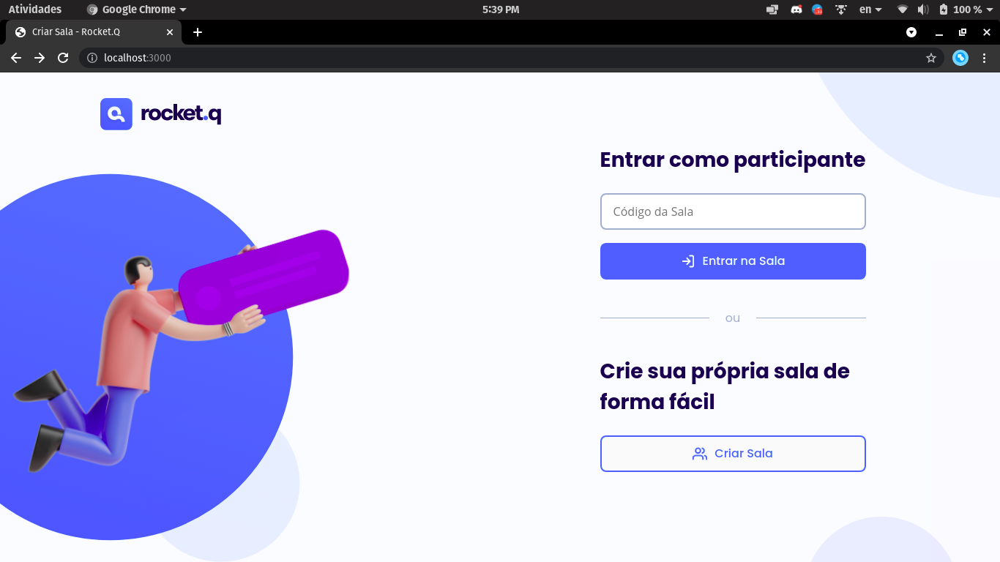

<h1 align="center">
Roquet.Q
</h1>

Projeto finalizado pelo evento da NLW#6

## 🚀 Tecnologias

Esse projeto foi desenvolvido com as seguintes tecnologias:

- HTML
- CSS
- JavaScript
- NodeJS
- EJS
- Express
- SQLite

## 💻 Projeto

O Rocket.Q é uma aplicação de interação através de perguntas, sendo possível criar uma sala para internautas anônimos fazerem perguntas e o criador da sala em posse de uma senha gerenciar essas perguntas e marcar como lidas.

## 🔖 Layout

Você pode visualizar o layout do projeto através [desse link](https://www.figma.com/file/vp3iFfd1ohCbHyDX9jCiQi/Roquet.q). É necessário ter conta no [Figma](https://figma.com) para acessá-lo.

## Rodando o projeto

Clone o projeto:
- ``git clone https://github.com/redmasters/roquetq.git``

Na pasta do projeto instale as depedencias:
- ``cd roquetq``

- ``npm install``

Inicie o banco de dados:
- ``npm run init-db``

Rode o projeto:
- ``npm run start``
 
Acesse-o via https://localhost:3000
